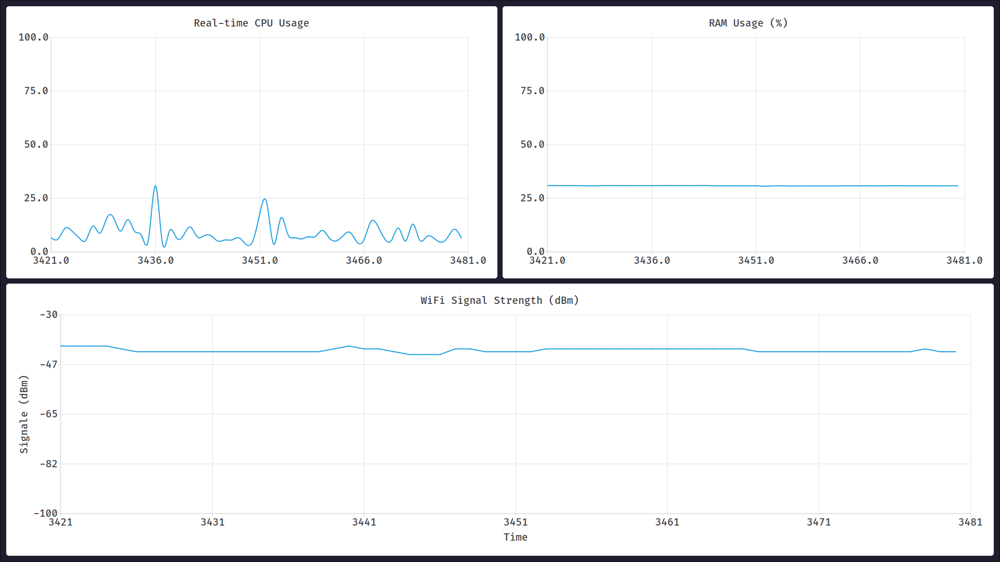

# QtMRL — Qt Moniteur de Ressources Linux

**QtMRL** est une application graphique développée en C++ avec Qt 6, conçue pour surveiller les ressources système sous Linux en temps réel. L’application fournit une interface claire avec des graphiques dynamiques pour observer l’utilisation du CPU, de la RAM, et la puissance du signal WiFi.

---

## 📌 Objectifs

- Offrir une interface moderne et fluide pour surveiller les performances du système.
- Visualiser en temps réel :
  - la puissance du signal WiFi,
  - l'utilisation de la mémoire vive (RAM),
  - l'activité du processeur (CPU).
- Étendre vers un moniteur complet (swap, processus, réseau...).

---

## ⚙️ Techniques utilisées

- **Langage** : C++
- **Framework** : Qt 6 (Widgets, Charts, QTimer, QProcess, QRegularExpression)
- **Outils Linux** : `iwconfig`, `free`, `top` ou `/proc/stat`
- **Modules Qt** :
  - `QChartView`, `QLineSeries`, `QTimer`, `QProcess`
  - `QValueAxis` pour personnaliser les axes
  - `QRegularExpression` pour parser les sorties shell

---

## 📊 Fonctionnalités actuelles

### 📶 Signal WiFi (classe `WifiSignalChart`)
- un constructeur pour eviter les problemes de rafraichissmenet
  ```
      explicit WifiSignalChart(QWidget *parent = nullptr);

- Détection automatique de l’interface sans-fil active (`detectWifiInterface()`).
  ```
      QString detectWifiInterface();
- Extraction du niveau du signal via `iwconfig` (`getSignalStrength()`).
  ```
      int getSignalStrength(const QString &interface);

- Extraction de `SSID` depuis la fonctionnalite `RegEx` (`RGularExpression`).
  ```
      QString getWifiSSID(const QString &interface);

- Mise à jour toutes les secondes du graphique (`updateChart()`).
  ```
      void updateChart();

- L'utilisation d'un `QLineSeries` pour afficher la courbe
  ```
      QLineSeries *series;

- L'utilisation d'un `QTimer` pour avoir la periodicite
  ```
      QLineSeries *series;
  

### 💾 Utilisation de la RAM (classe `RamUsageChart`)
- Lire depuis `"/proc/meminfo"` et ramene le pourcentage utilisee.
- Extraction de la mémoire utilisée par rapport à la mémoire totale.
  ```
  double getRamUsagePercentage() {
  std::ifstream meminfo("/proc/meminfo");
  std::string line;
  long totalMem = 0, freeMem = 0, buffers = 0, cached = 0;

  while (std::getline(meminfo, line)) {
    if (line.find("MemTotal:") == 0) {
      std::stringstream ss(line.substr(10));
      ss >> totalMem;
    } else if (line.find("MemFree:") == 0) {
      std::stringstream ss(line.substr(9));
      ss >> freeMem;
    } else if (line.find("Buffers:") == 0) {
      std::stringstream ss(line.substr(8));
      ss >> buffers;
    } else if (line.find("Cached:") == 0) {
      std::stringstream ss(line.substr(7));
      ss >> cached;
    }
  }

  long usedMem = totalMem - freeMem - buffers - cached;
  return totalMem > 0 ? static_cast<double>(usedMem) / totalMem * 100.0 : 0.0;
  }
- Affichage en temps réel avec une ligne de progression dynamique.

### 🧠 Activité CPU (classe `CpuUsageChart`)
- Lecture des données depuis `/proc/stat`.
  ```
  double CpuUsageChart::getCpuUsage() {
  std::ifstream stat("/proc/stat");
  std::string line;
  std::getline(stat, line);

  std::stringstream ss(line.substr(5));
  std::vector<long> cpuData;
  long value;
  while (ss >> value) {
    cpuData.push_back(value);
  }

  if (prevCpuData.empty()) {
    prevCpuData = cpuData;
    return 0.0;
  }

  long prevIdle = prevCpuData[3] + prevCpuData[4];
  long idle = cpuData[3] + cpuData[4];

  long prevNonIdle = prevCpuData[0] + prevCpuData[1] + prevCpuData[2] +
                     prevCpuData[5] + prevCpuData[6] + prevCpuData[7];
  long nonIdle = cpuData[0] + cpuData[1] + cpuData[2] + cpuData[5] +
                 cpuData[6] + cpuData[7];

  long prevTotal = prevIdle + prevNonIdle;
  long total = idle + nonIdle;

  long totalDiff = total - prevTotal;
  long idleDiff = idle - prevIdle;

  prevCpuData = cpuData;

  if (totalDiff == 0)
    return 0.0;

  return static_cast<double>(totalDiff - idleDiff) / totalDiff * 100.0;
  }
- Calcul de l'utilisation active du CPU à chaque seconde.
  ```
  connect(timer, &QTimer::timeout, this, &CpuUsageChart::updateChart);
  timer->start(250);
  
- Affichage en ligne du taux d'occupation du processeur.

---

## 📁 Structure du projet

```
QtMRL/
├── README.md
├── main.cpp
├── includes
│   ├── cpuusagechart.h
│   ├── ramusagechart.h
│   └── wifisignalchart.h
└── src
    ├── cpuusagechart.cpp
    ├── ramusagechart.cpp
    └── wifisignalchart.cpp
```
📌 Dépendances
Pour compiler et exécuter ce projet, vous devez installer les dépendances suivantes :
```bash
sudo apt-get update
sudo apt-get install qtbase6-dev libqt6charts-dev libqt6openglwidgets-dev qt6-qmake qt6-tools-dev g++ make libgl1-mesa-dev
```
---

## 📷 Screenshot



## 🧪 Compilation
``` bash
git clone https://github.com/LazzouziYoussefEtu/QtMRL
cd QtMRL
/usr/bin/qmake6 && make 
./QtMRL
```


## 👨‍💻 Auteur

Développé par **Youssef Lazzouzi**  
🔗 GitHub : [LazzouziYoussefEtu](https://github.com/LazzouziYoussefEtu)

---

## 📜 Licence

Ce projet est open-source sous licence MIT
